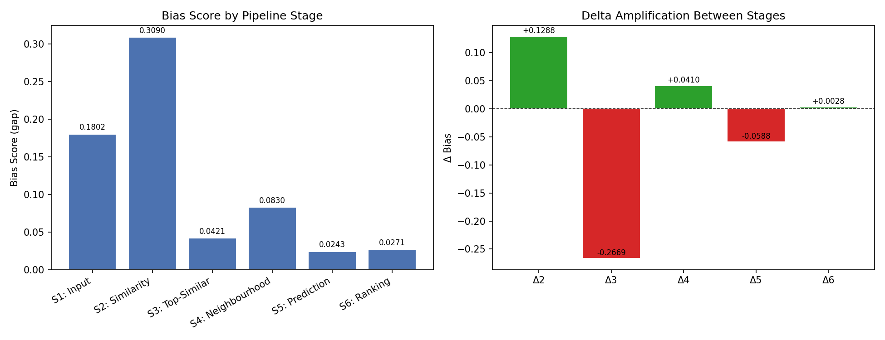
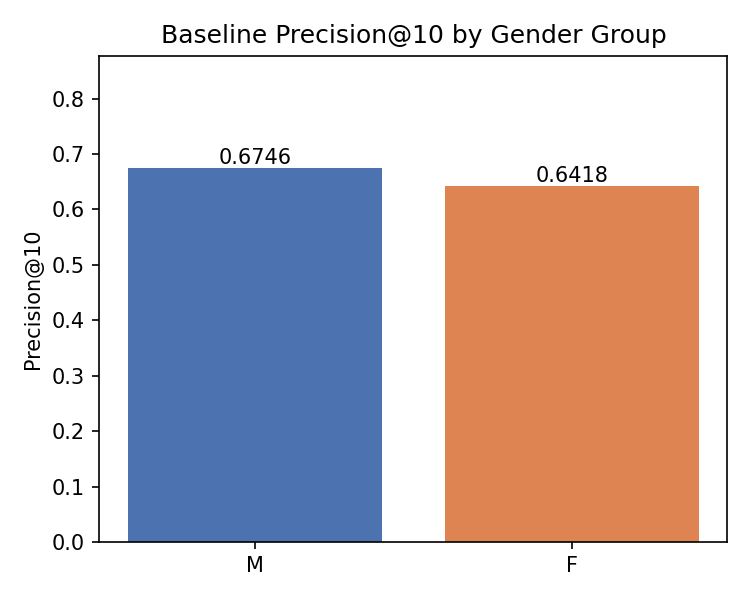
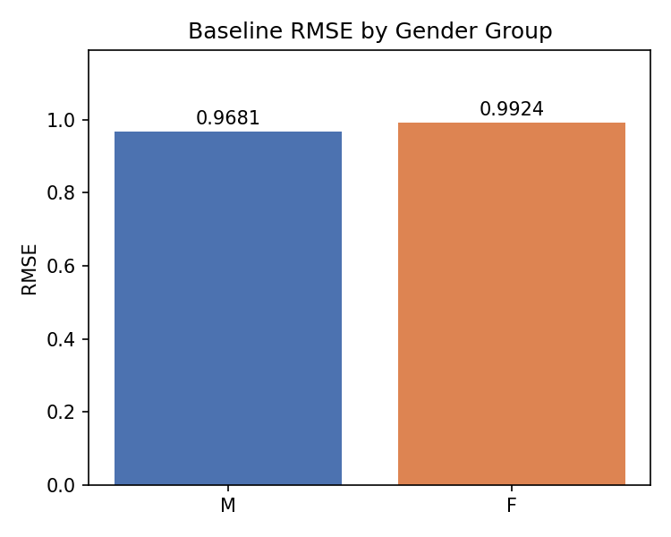
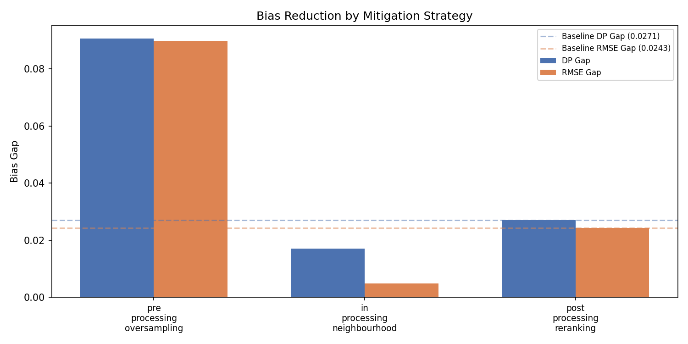
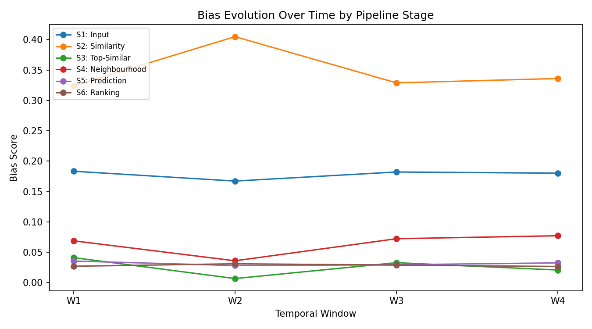
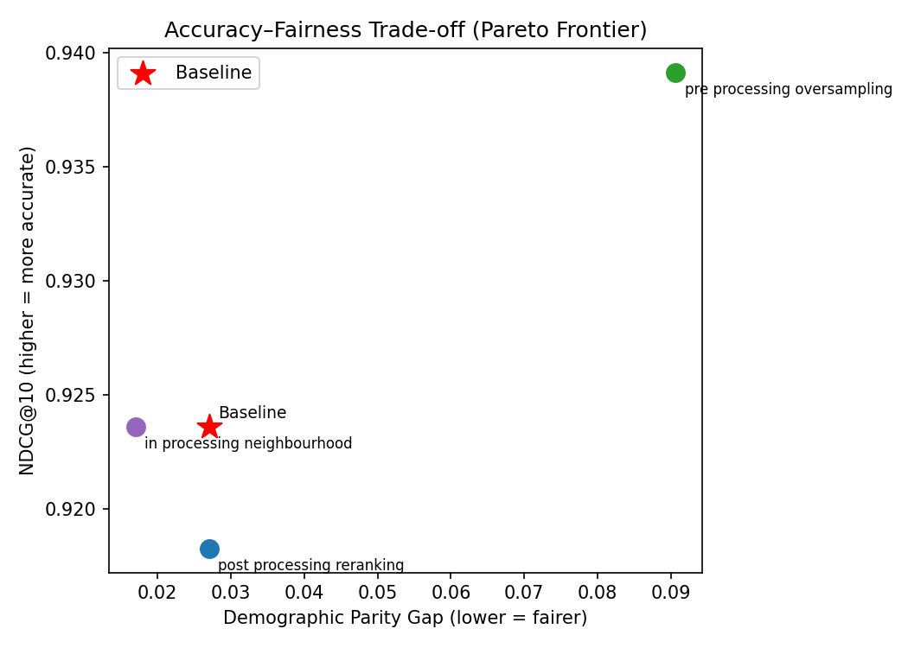

# Bias Mitigation in Collaborative Filtering

**Fairness in Recommendation Systems: Detecting and Mitigating 
Demographic Bias in Collaborative Filtering Algorithms**

MSc Artificial Intelligence and Data Science — Leeds Trinity University  
Student: Goodness Azike | Student ID: 2409960  
Supervisor: Nick Mitchell  
Module: COM7016 MSc Project

---

## Overview

This project investigates how demographic bias propagates across a 
user-based collaborative filtering pipeline and evaluates three 
mitigation strategies at different intervention points. A six-stage 
pipeline decomposition framework was implemented on the MovieLens 1M 
dataset, measuring demographic bias independently at each stage from 
input data through to final rankings.

The key finding is that output-only fairness measurement understates 
true internal disparity by more than eleven times. Stage 2 similarity 
computation is the dominant bias amplification point, with a bias score 
of 0.309 compared to an output-level gap of just 0.027.

---

## Research Questions

1. How does demographic bias propagate across the stages of a 
user-based collaborative filtering pipeline, and at which stage does 
amplification peak?
2. Which of the three mitigation strategies — pre-processing, 
in-processing, and post-processing — most effectively reduces 
demographic bias whilst preserving recommendation quality?
3. Are the observed bias patterns stable over time, or specific to a 
particular interaction snapshot?

---

## Dataset

**MovieLens 1M** (Harper & Konstan, 2015)
- 1,000,209 explicit ratings on a five-point scale
- 6,040 users across 3,883 films
- 95.5% matrix sparsity
- Gender distribution: 71.7% male / 28.3% female
- Data collected between 2000 and 2003

Download from: https://grouplens.org/datasets/movielens/1m/

Place the extracted files in a `data/` directory at the project root.

---

## Installation

**Requirements:** Python 3.9, pip
```bash
# Clone the repository
git clone https://github.com/goodness-py/bias-mitigation-cf.git
cd bias-mitigation-cf

# Create and activate virtual environment
python3 -m venv venv
source venv/bin/activate

# Install dependencies
pip install numpy"<2" scikit-surprise pandas matplotlib seaborn scipy 
scikit-learn
```

---

## Usage

**Run the full baseline experiment:**
```bash
python main_experiment.py
```

**Run individual mitigation strategies:**
```bash
python preprocessing.py           # Pre-processing oversampling
python mitigation_neighbourhood.py  # In-processing neighbourhood constraint
python mitigation_post.py         # Post-processing re-ranking
```

**Run temporal analysis:**
```bash
python temporal_analysis.py
```

All results are saved to the `results/` directory as JSON files and 
PNG visualisations.

---

## Project Structure
```
bias-mitigation-cf/
│
├── data/                          # MovieLens 1M dataset (not included)
├── results/                       # Experiment outputs (JSON + PNG)
│
├── main_experiment.py             # Main orchestration script
├── data_loader.py                 # Data loading and preprocessing
├── baseline_cf.py                 # KNNBasic collaborative filtering model
├── stage_extraction.py            # Extracts six pipeline stage artefacts
├── fairness_metrics.py            # Stage-level fairness metric computation
├── evaluation_metrics.py          # Accuracy metrics (RMSE, Precision, NDCG)
├── pipeline_decomposition.py      # Six-stage bias decomposition framework
├── preprocessing.py               # Pre-processing oversampling strategy
├── mitigation_neighbourhood.py    # In-processing neighbourhood constraint
├── mitigation_post.py             # Post-processing re-ranking strategy
├── mitigation_comparison.py       # Comparative mitigation analysis
├── temporal_analysis.py           # Temporal stability analysis
└── README.md
```

---

## Key Results

### Baseline Performance
| Metric | Male | Female | Gap |
|--------|------|--------|-----|
| RMSE | 0.968 | 0.992 | 0.024 |
| NDCG@10 | 0.927 | 0.916 | 0.011 |

### Six-Stage Pipeline Decomposition
| Stage | Bias Score | Delta |
|-------|------------|-------|
| S1: Input | 0.180 | — |
| S2: Similarity | 0.309 | +0.129 (amplification) |
| S3: Top-Similar | 0.042 | −0.267 (reduction) |
| S4: Neighbourhood | 0.083 | +0.041 (amplification) |
| S5: Prediction | 0.024 | −0.059 (reduction) |
| S6: Ranking | 0.027 | +0.003 (amplification) |

### Mitigation Strategy Comparison
| Strategy | DP Gap | RMSE Gap | Overall RMSE |
|----------|--------|----------|--------------|
| Baseline | 0.027 | 0.024 | 0.974 |
| Pre-processing | 0.091 | 0.090 | 0.939 |
| In-processing | 0.017 | 0.005 | 1.187 |
| Post-processing | 0.027 | 0.024 | 0.974 |

---

## Visualisations

### Pipeline Decomposition Waterfall


### Baseline Performance by Gender Group


### Baseline RMSE by Gender Group


### Mitigation Strategy Comparison


### Temporal Bias Over Time


### Mitigation Pareto Chart


## Technical Notes

- numpy < 2.0 is required for scikit-surprise compatibility
- Fixed random seed of 42 used for all experiments
- KNNBasic with cosine similarity and k=50 neighbours
- 80/20 train-test split

---

## Acknowledgements

Supervised by Nick Mitchell, Leeds Trinity University.  
Technical coaching provided by Victor.  
Dataset provided by GroupLens Research (Harper & Konstan, 2015).

---

## Citation

If you use this code or framework in your work, please cite:

Azike, G. (2026). *Fairness in recommendation systems: Detecting and 
mitigating demographic bias in collaborative filtering algorithms* 
[MSc dissertation]. Leeds Trinity University.

---

## Licence

This project is for academic purposes. The MovieLens dataset is subject 
to the GroupLens Research terms of use.
